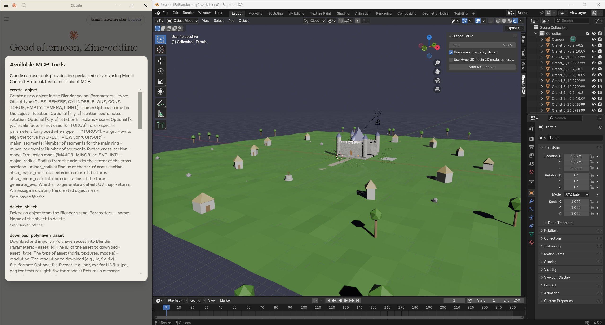

I've recently been experimenting with an exciting project at the intersection of AI and 3D design: Blender-MCP, which connects Claude Sonnet or other LLMs to Blender's UI through an MCP server.

The concept is fascinating - using natural language prompts to create 3D models without touching traditional modeling tools. After seeing impressive demos circulating on social media, I had to try it myself.

## What works beautifully

Blender-MCP shines when working with basic geometric shapes. The system understands concepts like "create a sphere," "add a cylinder," and "position a cube" remarkably well. It can follow step-by-step instructions to build compositions of these simple elements into more complex structures.

In one experiment, I built a simple castle using progressive prompts, guiding the AI through the process of creating towers, walls, and architectural details. The results were promising - while not photorealistic, the AI understood the concept and executed a recognizable castle structure.

## Current limitations

Like many cutting-edge tools, Blender-MCP is still evolving. Complex organic shapes or highly detailed models remain challenging. The system works best when you break down complex ideas into smaller, manageable steps using simple geometry as building blocks.

I found the most success when taking an iterative approach - starting with basic shapes and gradually refining them through additional prompts, rather than expecting perfect results from a single detailed instruction.

## The bigger picture

What excites me most about Blender-MCP isn't just what it can do today, but what it represents for the future of creative workflows. The project demonstrates how AI can lower barriers to 3D design, potentially making these tools accessible to those without traditional modeling expertise.

The open-source community has already begun enhancing the project with marketplaces for ready-to-use models and additional plugins, showing the power of collaborative innovation.

## Combining AI Tools for Superior Results

What I've discovered is that the true power of AI-driven 3D design emerges when combining complementary tools. While Blender-MCP excels with geometric shapes and positioning, it currently struggles with complex organic forms. This is where pairing it with state-of-the-art ML models like **Hunyuan3D-2** creates a workflow greater than the sum of its parts.

**Hunyuan3D-2: Scaling Diffusion Models for High Resolution Textured 3D Assets Generation** deserves special recognition. This remarkable model can generate detailed 3D assets from simple 2D images with impressive fidelity. The results are surprisingly sophisticated for an AI-generated model, especially considering how new this technology is.

In a recent experiment, I tested this workflow with a figurine of Luffy. I first used Hunyuan3D-2 to generate the base 3D model from a 2D reference, then imported it into Blender. From there, I leveraged Blender-MCP's natural language interface to enhance and smooth the results. The combined approach allowed me to achieve in minutes what would have taken hours of manual modeling.

This hybrid workflow represents what I believe is the future of AI-assisted creation - not replacing human creativity, but amplifying it by handling technical barriers and time-consuming tasks. By strategically combining AI tools based on their strengths, designers can save significant time while achieving higher quality results.

## Looking forward

As MCP (Model Context Protocol) technology continues to develop, we'll likely see rapid improvements in these tools' capabilities. What requires multiple careful prompts today might be achieved with a single instruction tomorrow.

If you're interested in exploring this space, I encourage you to check out the Blender-MCP project and Anthropic's documentation on MCP. Even if you encounter limitations, contributing feedback helps advance these technologies.

## References

- Blender-mcp : https://github.com/ahujasid/blender-mcp
- Model Context Protocol  : https://www.anthropic.com/news/model-context-protocol
- Hunyuan3D-2 github repo: https://github.com/Tencent/Hunyuan3D-2
- Hunyuan3D-2 HF Spaces : https://huggingface.co/spaces/tencent/Hunyuan3D-2