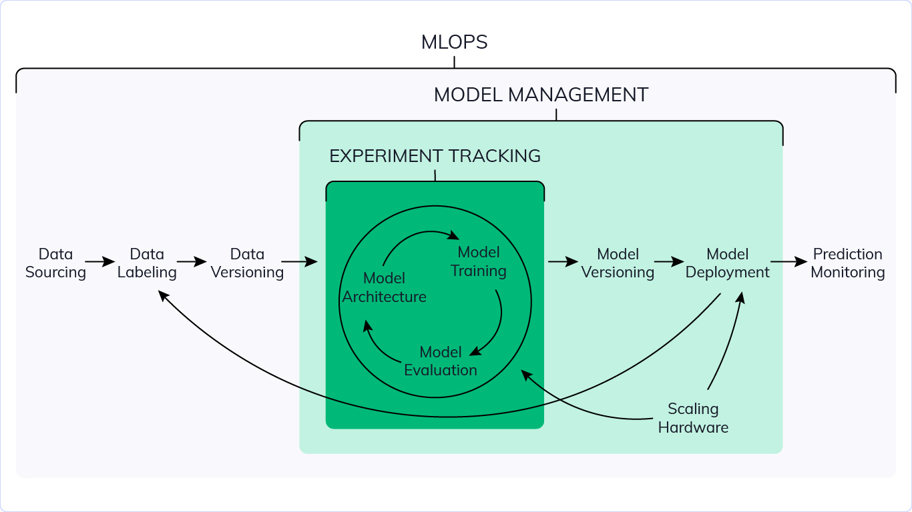
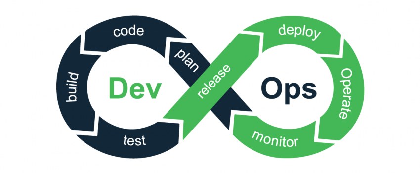
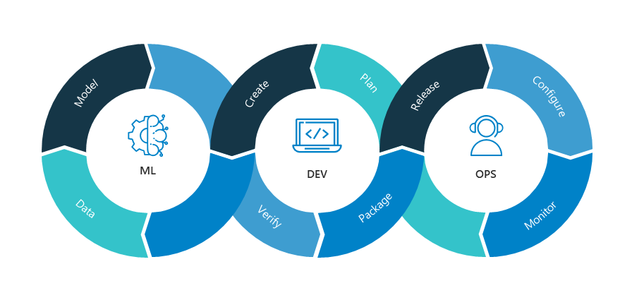
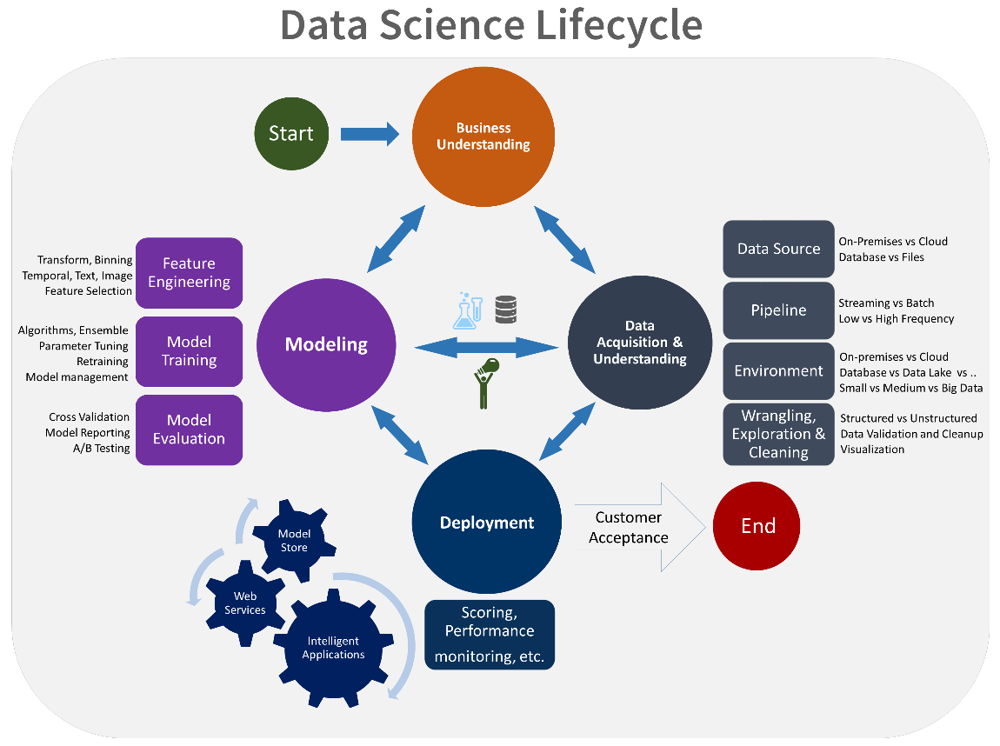
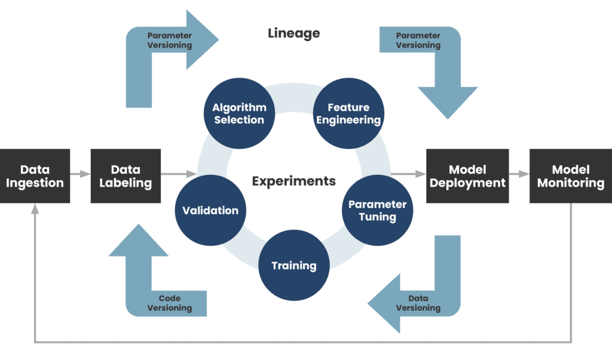

## Introduction

We hear more and more about MLOps. This practice, inspired by DevOps, aims to unify the tasks of developing Machine Learning applications with those of operations.

In this article, we will see what MLOps is, how it can be practiced and what tools are available to practice it.

In 2020, each person created at least 1.7 MB of data each second, according to techjury. That's sound good for data scientists since there are so many theories and ideas to investigate, play with, and numerous findings and models to make.

However, if we want to take this seriously and have these models interact with real-world business challenges and people, we must address the basics first, like acquiring and cleaning large amounts of data, setting up tracking and versioning for experiments and model training runs, setting up the deployment and monitoring pipelines for the models that do get to production.

Similar challenges occurred in the past when we tried to grow traditional software systems to accommodate additional users. DevOps provided a solution in the form of a set of practices for building, testing, deploying, and running large-scale software systems. DevOps shortened development times, enhanced deployment velocity, and made system releases auditable and durable.

That bring us to MLOps. It was formed at the junction of DevOps, Data Engineering, and Machine Learning, and while the concept is similar to DevOps, the implementation differs. ML systems are more experimental in nature, with additional components that are far more difficult to develop and run.

## What is MLOps?

MLOps is the operationalization of Machine Learning model management. This aims to create an end-to-end process for creating, implementing and managing repeatable, testable and scalable machine learning models. MLOps aims to:

- Unify the machine learning delivery cycle and the application development cycle
- Automation of Machine Learning tests (Data Validation, model testing, model integration testing, etc)
- Enables the application of agile principles to the Machine Learning project
- Supports model creation in CI/CD
- Reduces the technical debt of ML models
- Must be independent of languages, framework, platform, etc.

If there is anything to remember, it is that: MLOps is a set of practices that is intended to be as agile as possible and that must be based on the automation of the delivery and continuous integration processes of ML applications

The key phases of MLOps are:

- Data gathering
- Data analysis
- Data transformation/preparation
- Model training & development
- Model validation
- Model serving
- Model monitoring
- Model re-training.

### DevOps & MLOps

DevOps is a set of activities aimed at shortening the development life of a system and providing continuous delivery of high quality software. DevOps and MLOps both aim to bring software into a repeatable and fault tolerant workflow, but in MLOps that software also has a machine learning component.

Before deep diving into the comparison of DevOps and MLOps let's recall what is the DevOps Cycle

As teams strive for a quicker code-build-deploy loop, DevOps is a crucial concept in practically all successful IT projects. This gives teams the ability to deploy new features more quickly, allowing them to complete projects faster and with a higher quality final result. However, without adequate DevOps methods, teams face manual work, inability to test, and, as a result, dangerous production deployments.

An ideal DevOps cycle will include the following five important pillars for a successful project (https://www.youtube.com/watch?v=uTEL8Ff1Zvk):

- Reduce organizational silos
- Accept failure as normal
- Implement gradual changes
- Leverage tooling and automation
- Measure everything



And the common DevOps cycle that includes all these pillars looks like this:

### Comparison 

#### Cycle 

A code-validate-deploy cycle is included in both DevOps and MLOps pipelines. However, the MLOps pipeline also includes data and model stages that are necessary to create and train a machine learning model (see diagram below). As a result, MLOps has a few differences from traditional DevOps for each component of the workflow.

"data" and "model" here represent, in most cases, the data labeling, data transformation or feature engineering and algorithm selection process which we can call the experiment phase.

**Data labeling** is the process of adding the target to a chunk of data records and the model will use this as a training set. In the case of a supervised ML model this type of data is critical.

**Data transformation or feature engineering** is also an important step to preprocess and prepare the most suitable structure for the ML model in order to produce good results.

And **selecting algorithm process** depends on the nature of the prediction problem at hand.

The "Dev" and "Ops" parts are mostly the same at a high level.

The experimentation phase is unique to the data science lifecycle, which reflects how data scientists traditionally do their work. This differs from the way code developers do their work. The following diagram illustrates this life cycle in more detail.

#### Development and CI/CD 

The "development" takes two different meanings in each concept. In DevOps, by development we mean the code that creates an application or interface of some sort. The code is then wrapped up in an executable (artifact) that is deployed and validated against a series of tests. This cycle is ideally automated and continues until you have a final product. However, in MLOps the code is building/training a ML model. The output artifact here is a serialized file that can have data fed into it and produce inferences. The validation would be checking how well the trained model does against test data. Similarly, this is a cycle that continues until the model performs at a certain threshold.

#### Version control 

In a DevOps pipeline, version control is usually limited to tracking changes to code and artifacts. There are more things to track in an MLOps pipeline.

As mentioned before, the code in MLOps is building/training the ML model and it is an iterative cycle of experimenting. Each experimental run's components and metrics must be tracked in order to appropriately recreate it afterwards for auditing reasons. The data set utilized in training (train/test split), the model construction code, and the model artifact are among these components. The hyper-parameters and model performance are among the metrics (e.g., error rate).

When compared to standard software systems, this may appear to be a lot of information to keep track of. Fortunately, we have model registry tools (https://www.phdata.io/blog/what-is-a-model-registry/) as a tailor-made solution for versioning ML models.

#### Monitoring 

Model drift is an additional component to monitor in MLOps, in addition to the application itself. Because data is continuously changing, your model must as well. Models trained on older data may or may not perform well on new data, particularly if the data is seasonal.

In order to keep your model up to date, it will need to be re-trained regularly (https://www.phdata.io/blog/when-to-retrain-machine-learning-models/) to gain consistent value from it.

## Why MLOps?

The importance of MLOps cannot be overstated. By establishing more efficient processes, utilizing data analytics for decision-making, and enhancing customer experience, machine learning helps individuals and enterprises deploy solutions that uncover previously untapped streams of revenue, save time, and decrease cost.

These objectives are difficult to achieve without a solid foundation to operate within. MLOps automates model creation and deployment, resulting in faster time to market and lower operating expenses. It assists managers and developers in making more strategic and agile decisions.

MLOps provides as a road map for individuals, small teams, and even enterprises to fulfill their objectives regardless of their restrictions, such as sensitive data, limited resources, or a limited budget.

Because MLOps are not set in stone, you may choose the size of your map. You may try out various options and keep only what works for you.

## Best Practices

In this section, we will see the best practices for different parts of an ML project, Team, DATA, Metrics&KPI, Model, Code and the Deployment.

### Team 

- **Use A collaborative Development Platform:** by making consistent use of a collaborative dev platform teams can work together more effectively. All this is possible because dev platforms provides easy access to data, code, information and other tools. One other interesting thing is that platforms help teams to work together asynchronously or remotely. Collaborative development environments include GitHub, GitLab, BitBucket, and Azure DevOps Server.

- **Work Against a Shared Backlog:** intent to avoid misunderstanding on the content, priority and status of tasks because an actively maintained backlog enables coordination of tasks within the team and with external stakeholders. It also helps in planning ahead and performing retrospective evaluations.

- **Communicate and Collaborate with others:** The system that your team develops is meant to integrate with other systems within the context of a wider organization. this requires communication, alignment, and collaboration with others outside the team.

### Data  

- **Use Sanity Checks for All External Data Sources:** Avoid invalid or incomplete data being processed because data errors is crucial for model quality

- **Write Reusable Scripts for Data Cleaning and Merging:** Avoid untidy data wrangling scripts, reuse code and increase reproducibility.

- **Ensure Data Labelling is Performed in a Strictly Controlled Process:** Avoid invalid or incomplete labels, Controlling the data labelling process ensures label quality -- an important quality driver for supervised learning algorithms.

- **Make Data Sets Available on Shared Infrastructure (private or public):** Avoid data duplication, data bottlenecks, or unnecessary transfer of large data sets.

### Metrics & KPI 

- **At first, track multiple metrics, not necessarily the best one:** You want to make money, make your users happy, and make the world a better place. There are tons of metrics that you care about, and you should measure them all. However, early in the machine learning process, you will notice them all going up, even those that you do not directly optimize.

- **Establish Responsible AI Values:** Explicitly align all stakeholders on the ethical values and constraints of your machine learning application

- **Enforce Fairness and Privacy:** Avoid irresponsible use of machine learning and decisions with negative societal impact.

### Model  

The first thing to do with the model is to get it simple, interpretable and get the infrastructure right, that what makes debugging easier

- **Share a Clearly Defined Training Objective within the Team:** Avoid misunderstandings between multi-disciplinary team members. In a multi-disciplinary team, members with different backgrounds may misinterpret training objectives. Therefore, it is important to clearly communicate the objectives within the team.

- **Capture the Training Objective in a Metric that is Easy to Measure and Understand:** Ensure the machine learning objective is easy to measure and it is a good proxy for the true objective.

- **Test all Feature Extraction Code**: Avoid bugs in the feature extraction code to ensure the non presence of errors and bugs in the whole process.

- **Enable Parallel Training Experiments:** Avoid deadlocks during experimentation. Machine learning relies heavily on empirical processes. In order to allow fast experimentation and avoid deadlocks, it is recommended to think upfront of experiment parallelisation.

- **Continuously Measure Model Quality and Performance**

- **Use Versioning for Data, Model, Configurations and Training Scripts**

### Code 

- **Run Automated Regression Tests:** Avoid the introduction of bugs in code. When making changes, new defects can easily be introduced in existing code. A suite of automated regression tests helps to spot such defects as early as possible.

- **Use Continuous Integration**: Catch any code integration problems as early as possible. Code changes and additions may introduce problems into the software system as a whole. This can be detected by running an automated build script each time that code is committed to the versioning repository.

- **Assure Application Security**: to Prevent attackers from stealing or corrupting data, or from disrupting the availability of an application. Security incidents can lead to public data leaks, financial losses, or disrupt the availability of an application.

### Deployment 

- **Automate Model Deployment:** Increase the ability to deploy models on demand, which increases availability and scalability. Deploying and orchestrating different components of an application can be a tedious task. Instead of manually packaging and delivering models, and in order to avoid manual interventions or errors, one can automate this task.

- **Enable Shadow Deployment:** Test a model's behaviour on production data, without any impact on the service it provides. Before pushing a model into production, it is wise to test its quality and performance on data from production. In order to facilitate this task, one can deploy multiple models to 'shadow' each other.

- **Continuously Monitor the Behaviour of Deployed Models:** To Avoid unintended behaviour in production models. Once a model is promoted to production, the team has to understand how it performs.

- **Log Production Predictions with the Model's Version and Input Data:** To Enhance debugging, enable traceability, reproducibility, compliance and incident management. Tracing decisions back to the input data and the model's version can be difficult. It is therefore recommended to log production predictions together with the model's version and input data.

## Machine Learning Operations Maturity Model 

The purpose of this maturity model is to help clarify the principles and practices of Machine Learning Operations (MLOps). The maturity model shows continuous improvement in the creation and operation of a production-level machine learning application environment. You can use it as a metric to establish the incremental requirements needed to measure the maturity of a machine learning production environment and its associated processes.

As with most maturity models, the MLOps maturity model qualitatively assesses personas/culture, processes/structures, and objects/technologies. As the maturity level increases, the probability increases as incidents or errors lead to quality improvements in the development and production processes.

The MLOps maturity model encompasses five levels of technical capability:

| **Level** | **Description** | **Key points** | **Technology** |
|-----------|----------------|----------------|----------------|
| 0 | [No MLOps](https://docs.microsoft.com/en-ie/azure/architecture/example-scenario/mlops/mlops-maturity-model#level-0-no-mlops) | - Difficulty in managing the full life cycle of machine learning models - Teams are heterogeneous and releases are painful - Most systems exist as "black boxes", little feedback during/after deployment | - Manual builds and deployments - Manual model and application testing - No centralized monitoring of model performance - Model training is manual |
| 1 | [DevOps but no MLOps](https://docs.microsoft.com/en-ie/azure/architecture/example-scenario/mlops/mlops-maturity-model#level-1-devops-no-mlops) | - Production releases are less painful than non-MLOps, but rely on the data team for each new model - Feedback on model performance in production is always limited - Difficult trace/reproduction results | - Automated Builds - Automated tests for the application code |
| 2 | [Automated Training](https://docs.microsoft.com/en-ie/azure/architecture/example-scenario/mlops/mlops-maturity-model#level-2-automated-training) | - The training environment is fully managed and traceable - Easy to reproduce model - Versions are manual, but low friction | - Automated model learning - Centralized tracking of training model performance - Model management |
| 3 | [Automated Model Deployment](https://docs.microsoft.com/en-ie/azure/architecture/example-scenario/mlops/mlops-maturity-model#level-3-automated-model-deployment) | - Low-friction, automatic releases - Full traceability from deployment to source data - Entire environment managed: training > testing > production | - Integrated A/B testing of model performance for deployment - Automated testing for all code - Centralized tracking of training model performance |
| 4 | [Full MLOps Automated Operations](https://docs.microsoft.com/en-ie/azure/architecture/example-scenario/mlops/mlops-maturity-model#level-4-full-mlops-automated-retraining) | - Complete automated and easily monitored system - Production systems provide information on how to improve and, in some cases, automatically, new models - Approach of a system without dead time | - Automated training and testing of models - Feedback, centralized metrics from a deployed model |

For more information on each level, please click on the link in the description.

## Types of MLOps solutions 

Depending on your needs, the choice of the MLOps solution can be made on the following two types:

1. End to end MLOps solution
2. Custom build MLOps solution

### End to end MLOps solution

These type of solution provides data scientists the ability to build, train and deploy ML models quickly, the solutions are fully managed services. And the best solutions for this type could be:

- **Amazon:**
  - **Amazon sagemaker:** Amazon SageMaker is an ML service that enables data scientists and engineers, as well as MLOps engineers and business analysts, to create, train, and deploy ML models for any use case, regardless of their level of ML expertise.

- **Google Cloud MLOps suite:**
  - **Dataflow:** Fast, unified and cost-effective serverless batch and stream data processing.
  - **Kubeflow pipelines:** Kubeflow Pipelines is a platform for building and deploying portable, scalable machine learning (ML) workflows based on Docker containers.
  - **Google Kubernetes Engine:** A simple way to automatically deploy, scale and manage Kubernetes.
  - **TFX:** TensorFlow Extended (TFX) is an end-to-end platform for deploying production ML pipelines
  - **Vertex AI Workbench**: A single development environment for the entire data science workflow.
  - **ML kit:** Machine learning for mobile developers, ML Kit brings Google's machine learning expertise to mobile developers in a powerful and easy-to-use package. Make your iOS and Android apps more engaging, personalized, and helpful with solutions that are optimized to run on device.

- **Microsoft Azure MLOps suite:**
  - **Azure Machine Learning:** Empower data scientists and developers to build, deploy, and manage high-quality models faster and with confidence. Accelerate time to value with industry-leading machine learning operations (MLOps), open-source interoperability, and integrated tools. Innovate on a secure, trusted platform designed for responsible AI applications in machine learning.
  - **Azure Kubernetes Service (AKS):** Azure Kubernetes Service (AKS) offers the quickest way to start developing and deploying cloud-native apps, with built-in code-to-cloud pipelines and guardrails. Get unified management and governance for on-premises, edge, and multicloud Kubernetes clusters. Interoperate with Azure security, identity, cost management, and migration services.
  - **Azure Pipelines:** Continuously build, test, and deploy to any platform and cloud.
  - **Azure Monitor:** Azure Monitor helps you maximize the availability and performance of your applications and services.

### Custom built MLOps solution 

For making the pipeline robust, the custom-built solution is the best for you, this approach can help you avoid a single point of failure and makes your pipeline easier to audit, debug and more customizable. There are many tools available for this approach:

- **Project jupyter:** Free software, open standards, and web services for interactive computing across all programming languages
- **Nbdev:** a library that allows you to develop a python library in Jupyter Notebooks, putting all your code, tests and documentation in one place.
- **Airflow:** Airflow is a platform created to programmatically author, schedule and monitor workflows.
- **Kubeflow:** The Machine Learning Toolkit for Kubernetes.
- **MLflow:** An open source platform for the machine learning lifecycle
- **Neptune:** Neptune is an ML metadata store that was built for research and production teams that run many experiments.
- **Optuna:** An open source hyperparameter optimization framework to automate hyperparameter search
- **Cortex:** Deploy, manage, and scale machine learning models in production.

## Conclusion

Now that you have in mind all the definitions and best practices of MLOps, you can chose one of the two solutions and go for it. Even better I invite you to consult my next article where I will present a solution and implementation of a MLOps pipeline.

## References

- [https://se-ml.github.io/practices/](https://se-ml.github.io/practices/)
- [https://developers.google.com/machine-learning/guides/rules-of-ml](https://developers.google.com/machine-learning/guides/rules-of-ml)
- [https://docs.microsoft.com/en-ie/azure/architecture/example-scenario/mlops/mlops-maturity-model](https://docs.microsoft.com/en-ie/azure/architecture/example-scenario/mlops/mlops-maturity-model)
- [https://docs.microsoft.com/en-ie/azure/architecture/example-scenario/mlops/aml-decision-tree](https://docs.microsoft.com/en-ie/azure/architecture/example-scenario/mlops/aml-decision-tree)
- [https://docs.microsoft.com/en-ie/azure/architecture/data-guide/azure-dataops-architecture-design](https://docs.microsoft.com/en-ie/azure/architecture/data-guide/azure-dataops-architecture-design)
- [https://docs.microsoft.com/fr-fr/azure/architecture/example-scenario/mlops/mlops-technical-paper](https://docs.microsoft.com/fr-fr/azure/architecture/example-scenario/mlops/mlops-technical-paper)
- [https://neptune.ai/blog/category/mlops](https://neptune.ai/blog/category/mlops)
- [https://www.phdata.io/blog/when-to-retrain-machine-learning-models/](https://www.phdata.io/blog/when-to-retrain-machine-learning-models/)
- [https://www.phdata.io/blog/what-is-a-model-registry/](https://www.phdata.io/blog/what-is-a-model-registry/)
- [https://www.youtube.com/watch?v=uTEL8Ff1Zvk](https://www.youtube.com/watch?v=uTEL8Ff1Zvk)
- [https://cloud.google.com/architecture/mlops-continuous-delivery-and-automation-pipelines-in-machine-learning#devops_versus_mlops](https://cloud.google.com/architecture/mlops-continuous-delivery-and-automation-pipelines-in-machine-learning#devops_versus_mlops)
- [https://www.datasciencecentral.com/mlops-vs-devops-the-similarities-and-differences/](https://www.datasciencecentral.com/mlops-vs-devops-the-similarities-and-differences/)
- [https://towardsdatascience.com/building-a-devops-pipeline-for-machine-learning-and-ai-evaluating-sagemaker-cf7fdd3632e7](https://towardsdatascience.com/building-a-devops-pipeline-for-machine-learning-and-ai-evaluating-sagemaker-cf7fdd3632e7)