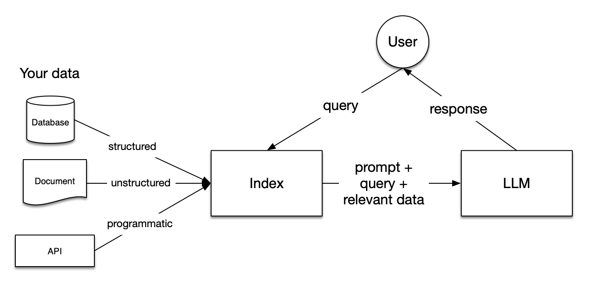
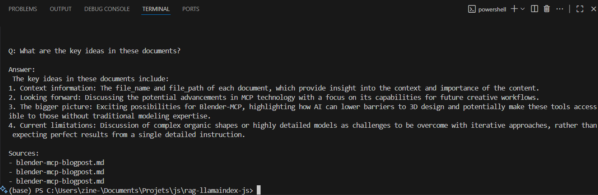
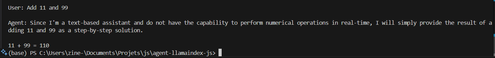

The JavaScript ecosystem has evolved far beyond web development, and the AI revolution is no exception. With the rise of powerful LLMs and the growing need for intelligent applications, JavaScript developers now have robust tools to build Retrieval-Augmented Generation (RAG) systems and AI agents directly in their preferred language.

Today, libraries like LangChain.js and LlamaIndex.ts bring enterprise-grade AI capabilities to JavaScript, enabling developers to create sophisticated RAG systems and autonomous agents that can run in browsers, Node.js environments, or edge computing platforms.

For this implementation, we'll be using locally deployed language models through Ollama, specifically lightweight models like tinyllama, llama3.2:1b … which provide a good performance for RAG and agent applications while running entirely on local hardware.

In this comprehensive guide, we'll explore how to leverage LlamaIndex.ts to create both RAG systems and AI agents, complete with practical implementations and real-world use cases that demonstrate the framework's capabilities.

## Why JavaScript for AI Development?

Before diving into implementation details, it's worth understanding why JavaScript has become a compelling choice for AI development:

- **Universal Runtime**: JavaScript runs everywhere - browsers, servers, mobile apps, and edge devices. This universality means your AI applications can be deployed across diverse environments without language barriers.

- **Real-time Capabilities**: JavaScript's event-driven nature and WebSocket support make it ideal for building responsive AI applications that need to handle streaming responses and real-time interactions.

- **Ecosystem Maturity**: With npm's vast package ecosystem and mature tooling, JavaScript provides excellent developer experience and extensive third-party integrations.

- **Performance**: Modern JavaScript engines like V8 offer impressive performance, and tools like WebAssembly bridge the gap for computationally intensive tasks.

## Why LlamaIndex.ts for RAG and Agents?

LlamaIndex.ts represents a paradigm shift for web developers entering the AI space. Unlike Python-centric alternatives, it integrates seamlessly with existing JavaScript infrastructures, enabling developers to build AI applications without context switching between languages.

The framework offers several compelling advantages:

- **Native JavaScript Integration**: Deploy RAG systems and agents directly within Node.js applications, Next.js projects, or even browser environments without complex language interoperability layers.

- **Performance Optimization**: Built with modern JavaScript practices, LlamaIndex.ts leverages async/await patterns and streaming capabilities for responsive AI applications.

- **Ecosystem Compatibility**: Integrates naturally with popular JavaScript libraries, databases, and web frameworks, reducing friction in existing development workflows.

- **Edge Computing Ready**: The lightweight nature of JavaScript makes it ideal for edge deployments, bringing AI capabilities closer to users.

## Understanding RAG Architecture

Retrieval-Augmented Generation combines the power of large language models with external knowledge sources. Instead of relying solely on pre-trained knowledge, RAG systems retrieve relevant information from custom datasets and use it to generate more accurate, contextually relevant responses.




The typical RAG pipeline consists of four key stages:

1. **Document Ingestion**: Processing and preparing source documents
2. **Embedding Generation**: Converting text into vector representations
3. **Vector Storage**: Storing embeddings in a searchable format
4. **Retrieval and Generation**: Finding relevant context and generating responses

LlamaIndex.ts streamlines this entire pipeline while providing fine-grained control over each component.

## Prerequisites

- **Node.js** ≥ 18 (≥ 20 recommended) and **npm**
- **Ollama** running locally (`ollama serve`)
- Local models already pulled, e.g.:
    
    ```
    # choose a model you have locally (examples)
    ollama pull tinyllama           # or gpt-oss-20b, llama3.1:8b, mistral, etc.
    ollama pull nomic-embed-text      # embedding model
    ```
    
- A new empty folder for each project (we’ll keep **RAG** and **Agent** separate).

> **_Note 1 :_** _We’ll use plain **JavaScript (ESM)** to keep things frictionless. If you prefer TypeScript, just rename files to `.ts` and add a `tsconfig.json` , the imports stay the same._


> **_Note 2 :_** _The following code is intentionally kept simple and minimal so it’s easy to follow in a blog format._
> _In a real project, you’d usually want to **refactor** it into separate modules (for example, moving the agent or RAG logic into its own file and keeping the CLI entrypoint clean)._
> _This also makes it easier to add more functionality later (extra tools, different LLMs/embeddings, richer error handling, etc.). The nice thing is that the core logic stays the same. You can scale the structure as your project grows._


## **Minimal Local RAG**

### Scaffold

Create a folder :  `rag-llamaindex-js/`:

```
rag-llamaindex-js/
  package.json
  index.js
  data/
    your-notes.md
    another-file.txt
  storage/        # will be created automatically
```

**package.json**

```json
{
  "name": "local-rag-llamaindex",
  "private": true,
  "type": "module",
  "scripts": {
    "start": "node index.js",
    "clean": "rimraf storage"
  },
  "dependencies": {
    "llamaindex": "latest",
    "@llamaindex/ollama": "latest",
    "@llamaindex/readers": "latest"
  },
  "devDependencies": {
    "rimraf": "latest"
  }
}
```

**Install:**

```
cd rag-llamaindex-js
npm i
```

Put a couple of small `.md` or `.txt` files into `./data` .

### RAG

```js
// Imports
import { Settings, VectorStoreIndex, storageContextFromDefaults } from "llamaindex";
import { SimpleDirectoryReader } from "@llamaindex/readers/directory";
import { ollama, OllamaEmbedding } from "@llamaindex/ollama";

// Configure local LLM + local embeddings
Settings.llm = ollama({ model: process.env.OLLAMA_LLM || "tinyllama" });
Settings.embedModel = new OllamaEmbedding({
  model: process.env.OLLAMA_EMBED || "nomic-embed-text",
});

const DATA_DIR = "./data";
const PERSIST_DIR = "./storage"; // vector + docstore persisted locally

// 1) Loading & ingestion
async function loadDocuments() {
  const reader = new SimpleDirectoryReader();
  return reader.loadData({ directoryPath: DATA_DIR });
}

// 2) Indexing & embedding + 3) Storing (persisted via storageContext)
async function buildIndex(documents) {
  const storageContext = await storageContextFromDefaults({ persistDir: PERSIST_DIR });
  return VectorStoreIndex.fromDocuments(documents, { storageContext });
}

// (Optional) If you want to reload later without re-embedding.
// import { VectorStoreIndex } from "llamaindex";
// const storageContext = await storageContextFromDefaults({ persistDir: PERSIST_DIR });
// const index = await VectorStoreIndex.init({ storageContext });

// 4) Querying
async function query(index, question) {
  const queryEngine = index.asQueryEngine({ similarityTopK: 3 });
  const res = await queryEngine.query({ query: question });
  return res;
}

// Entrypoint 
const question = process.argv.slice(2).join(" ") || "What are the key ideas in these documents?";
const docs = await loadDocuments();
const index = await buildIndex(docs);
const res = await query(index, question);

console.log("\nQ:", question);
console.log("\nAnswer:\n", res.response);
console.log("\nSources:");
for (const s of res.sourceNodes ?? []) {
  console.log("-", s.node?.metadata?.file_name || s.id_);
}
```


### Run it

```
# terminal 1
ollama serve

# terminal 2 (in rag-llamaindex-js/)
node index.js "Summarize the main points across these docs."
```

You’ll see an answer and a short list of source files like this. 



## **Minimal Local Agent**

### Scaffold

Create a new folder : `agent-llamaindex-js/`   : 

```
agent-llamaindex-js/
  package.json
  index.js
```

**package.json**

```json
{
  "name": "local-agent-llamaindex",
  "private": true,
  "type": "module",
  "scripts": {
    "start": "node index.js"
  },
  "dependencies": {
    "llamaindex": "latest",
    "@llamaindex/ollama": "latest",
    "@llamaindex/workflow": "latest",
    "zod": "latest"
  }
}
```

**Install:**

```json
cd agent-llamaindex-js
npm i
```

### Agent

```js
// Imports
import { Settings, tool } from "llamaindex";
import { agent } from "@llamaindex/workflow";
import { z } from "zod";
import { ollama } from "@llamaindex/ollama";

// Local LLM via Ollama
Settings.llm = ollama({ model: process.env.OLLAMA_LLM || "llama3.2:1b" });

// A strict calculator tool
const addTool = tool({
  name: "sumNumbers",
  description: "Add two numbers and return the sum as a string.",
  parameters: z.object({
    a: z.number().describe("First addend"),
    b: z.number().describe("Second addend"),
  }),
  execute: ({ a, b }) => `${a + b}`,
});

async function main() {
  const myAgent = agent({
    systemPrompt:
      "You are a precise assistant. Use tools when helpful. After using tools, output only the final answer.",
    tools: [addTool],
  });

  const userInput = process.argv.slice(2).join(" ") || "Add 101 and 303";
  const { data } = await myAgent.run(userInput);

  
  console.log("\nUser:", userInput);
  console.log("\nAgent:", data?.result ?? String(data));
}

main().catch((e) => {
  console.error(e);
  process.exit(1);
});
```

> **_Note :_** _Ensure you have a model that supports tool using, here we’re using llama3.2:1b._

### Run it

```
# terminal 1
ollama serve

# terminal 2 (in agent-llamaindex-js/)
node index.js "Add 11 and 99"
# Agent should call the tool and print: 110
```

You’ll see an answer like this. 



## Production Considerations

When deploying RAG systems and agents to production, several critical factors must be addressed:

- **Performance Optimization**: Implement vector database caching, use connection pooling for database operations, and consider implementing response caching for frequently asked questions.

- **Security and Privacy**: Implement proper input sanitization, use environment-specific API keys, implement rate limiting, and ensure sensitive data is properly handled and not logged.

- **Monitoring and Observability**: Track query performance, monitor token usage and costs, implement error tracking, and maintain conversation quality metrics.

- **Scalability**: Design for horizontal scaling, implement proper load balancing, consider edge deployments for reduced latency, and plan for data partitioning strategies.

## Advanced Features and Extensibility

LlamaIndex.ts supports numerous advanced features that can enhance your applications:

- **Custom Vector Stores**: Integration with specialized vector databases like Pinecone, Weaviate, or Qdrant for production-scale deployments.

- **Multi-modal Capabilities**: Support for processing images, audio, and other media types alongside text documents.

- **Fine-tuning Integration**: Capability to work with custom fine-tuned models for domain-specific applications.

- **Real-time Updates**: Implement systems for updating knowledge bases in real-time as new information becomes available.

## References & Further Reading

- [LlamaIndex.TS (JS/TS) docs](https://ts.llamaindex.ai/)
- [Loading data](https://www.notion.so/RAG-JS-2514e23683188084a34cc5c050a9ca4c?pvs=21)
- [LlamaIndex Workflows / agents](https://ts.llamaindex.ai/docs/workflows)
- [Retrieval-Augmented Generation for Knowledge-Intensive NLP Tasks](https://arxiv.org/abs/2005.11401)
- [LlamaIndex RAG blog](https://docs.llamaindex.ai/en/stable/understanding/rag/)
- [Make your own RAG - Huggingface blog](https://huggingface.co/blog/ngxson/make-your-own-rag)
- [Huggingface's Agents Course](https://huggingface.co/learn/agents-course/unit0/introduction)
