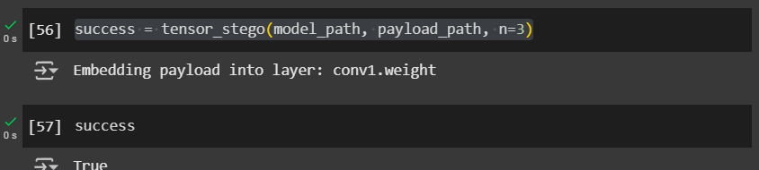
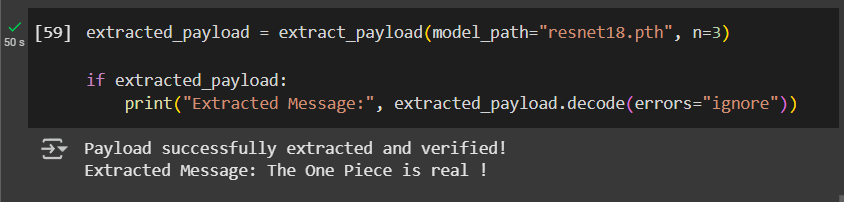

## Introduction

As deep learning models become increasingly integrated into critical systems, the security implications of these AI models demand closer analysis. While much attention has focused on adversarial attacks and model poisoning, a more subtle threat lurks in the architecture of neural networks themselves: tensor steganography. This technique allows malicious actors to embed hidden payloads directly within model weights without significantly affecting performance, creating a potential vector for distributing malware that bypasses traditional security measures.

In this article, I'll explore how tensor steganography works, demonstrate its feasibility in popular models like ResNet18, and explain why security professionals and ML engineers should be concerned about this emerging threat vector.

## What is Tensor Steganography?

Steganography is the practice of hiding information within other non-secret data or a physical object to avoid detection. Unlike encryption, which makes data unreadable but visible, steganography conceals the very existence of the hidden data.

Tensor steganography applies this concept to neural networks by embedding data in the least significant bits of the floating-point values that make up model weights. These minor alterations are virtually undetectable through casual inspection and have minimal impact on model performance, making them an ideal hiding place for malicious code.


Overall Workflow (from : EvilModel: Hiding Malware Inside of Neural
Network Models. )

## Feasibility Analysis: The ResNet18 Case Study
To understand the risk, let's analyze the capacity for hidden data in a relatively small model like ResNet18. The largest convolutional layer in ResNet18 contains approximately 9.4MB of floating-point values . By manipulating just the least significant bits of each float's mantissa, we can embed surprising amounts of data:

| **Bits Modified Per Float** | **Storage Capacity** |
| --- | --- |
| 1-bit | 294.9 kB |
| 2-bits | 589.8 kB |
| 3-bits | 884.7 kB |
| 4-bits | 1.2 MB |
| 5-bits | 1.5 MB |
| 6-bits | 1.8 MB |
| 7-bits | 2.1 MB |
| 8-bits | 2.4 MB |

This analysis reveals that even a modest model like ResNet18 can conceal up to 2.4MB of data by modifying just 8 bits per float in a single layer. Larger models commonly used in production environments could potentially hide much more — up to 9MB of malicious code using only 3 bits per float in a single layer.

## Implementation: How Tensor Steganography Works

Below is a Python implementation that demonstrates how to embed an arbitrary payload into a PyTorch model using steganography. This is a simple and naive example for illustrative purposes. In practice, a malicious actor could employ far more sophisticated techniques, making the detection and analysis of such hidden data significantly more challenging.

### 1. Import Dependencies

We first import the required libraries:

```python
import os
import struct
import hashlib
from pathlib import Path

import torch
import numpy as np
```

### 2. Function Definition and Validations

We define the function and validate the bit-depth parameter `n`:

```python
def tensor_stego(model_path: Path, payload_path: Path, n: int = 1) -> bool:
    """
    Embeds a payload inside the least significant bits (LSB) of the weights in a PyTorch model.

    Args:
        model_path (Path): Path to the PyTorch model (.pt or .pth).
        payload_path (Path): Path to the binary payload file.
        n (int): Number of LSBs to use (1-8). Default is 1.

    Returns:
        bool: True if embedding was successful, False otherwise.
    """
    if not (1 <= n <= 8):
        raise ValueError("n must be between 1 and 8.")

```

### 3. Load the Model

We load the model and ensure it's on the CPU:

```python
model = torch.load(model_path, map_location=torch.device("cpu"))
```

### 4. Read & Prepare the Payload

Before embedding, we format the payload to include:

1. **File size** (so it can be reconstructed correctly)
2. **SHA-256 hash** (for integrity verification)
3. **The actual payload data**

```python
with open(payload_path, "rb") as file:
    payload_data = file.read()

payload_size = os.path.getsize(payload_data)
payload_hash = hashlib.sha256(payload_data).hexdigest().encode()

# Pack size (4 bytes) + hash (64 bytes) + actual data
payload = struct.pack("i", payload_size) + payload_hash + payload_data
```

### 5. Convert Payload to Bit Stream

```python
bits = np.unpackbits(np.frombuffer(payload, dtype=np.uint8))

# Ensure the bit stream is a multiple of `n` by padding with zeros
padding_size = (n - (len(bits) % n)) % n
bits = np.pad(bits, (0, padding_size), constant_values=0)

bits_iter = iter(bits)
```

### 6. Embed the Bits into the Model’s Tensors

```python
for name, tensor in model.items():
  tensor_data = tensor.data.numpy()

  # Check if the tensor has enough capacity to store the payload
  if tensor_data.size * n < len(bits):
      continue  # Skip this tensor if it's too small

  print(f"Embedding payload into layer: {name}")

  # Compute the LSB mask 
  mask = 0xff
  for i in range(0, tensor_data.itemsize):
    mask = (mask << 8) | 0xff
  
  mask = mask - (1 << n) + 1

  # Create a read/write iterator for the tensor
  with np.nditer(tensor_data.view(np.uint32) , op_flags=["readwrite"]) as tensor_iterator:
    # Iterate over float values in tensor
    for f in tensor_iterator:
      # Get next bits to embed from the payload
      lsb_value = 0
      for i in range(0, n):
        try:
          lsb_value = (lsb_value << 1) + next(bits_iter)
        except StopIteration:
          assert i == 0

          # Save the model back to disk
          torch.save(model, f=model_path)
          return True

        # Embed the payload bits into the float
        f = np.bitwise_and(f, mask)
        f = np.bitwise_or(f, lsb_value)

        # Update the float value in the tensor
        tensor_iterator[0] = f
  

return False
```

### 7. Save the Modified Model

The model is automatically saved inside the loop when the entire payload is embedded. If embedding fails, we return `False`.

***N.B : This code includes a verification mechanism (SHA256 hash) to ensure the payload can be correctly extracted later. The payload format consists of the data size, a hash for verification, and the actual content.***

Below is the full script in one place for convenience:

```python
import os
import struct
import hashlib
from pathlib import Path

import torch
import numpy as np

def tensor_stego(model_path: Path, payload_path: Path, n: int = 1) -> bool:
    """
    Embeds a payload inside the least significant bits (LSB) of the weights in a PyTorch model.

    Args:
        model_path (Path): Path to the PyTorch model (.pt or .pth).
        payload_path (Path): Path to the binary payload file.
        n (int): Number of LSBs to use (1-8). Default is 1.

    Returns:
        bool: True if embedding was successful, False otherwise.
    """
    if not (1 <= n <= 8):
        raise ValueError("n must be between 1 and 8.")

    model = torch.load(model_path, map_location=torch.device("cpu"))

    with open(payload_path, "rb") as file:
      payload_data = file.read()

    payload_size = os.path.getsize(payload_path)
    payload_hash = hashlib.sha256(payload_data).hexdigest().encode()

    # Pack size (4 bytes) + hash (64 bytes) + actual data
    payload = struct.pack("i", payload_size) + payload_hash + payload_data

    bits = np.unpackbits(np.frombuffer(payload, dtype=np.uint8))

    # Ensure the bit stream is a multiple of `n` by padding with zeros
    padding_size = (n - (len(bits) % n)) % n
    bits = np.pad(bits, (0, padding_size), constant_values=0)

    bits_iter = iter(bits)

    for name, tensor in model.items():
      tensor_data = tensor.data.numpy()

      # Check if the tensor has enough capacity to store the payload
      if tensor_data.size * n < len(bits):
          continue  # Skip this tensor if it's too small

      print(f"Embedding payload into layer: {name}")

      # Compute the LSB mask 
      mask = 0xff
      for i in range(0, tensor_data.itemsize):
        mask = (mask << 8) | 0xff
      
      mask = mask - (1 << n) + 1

      # Create a read/write iterator for the tensor
      with np.nditer(tensor_data.view(np.uint32) , op_flags=["readwrite"]) as tensor_iterator:
        # Iterate over float values in tensor
        for f in tensor_iterator:
          # Get next bits to embed from the payload
          lsb_value = 0
          for i in range(0, n):
            try:
              lsb_value = (lsb_value << 1) + next(bits_iter)
            except StopIteration:
              assert i == 0

              # Save the model back to disk
              torch.save(model, f=model_path)
              return True

            # Embed the payload bits into the float
            f = np.bitwise_and(f, mask)
            f = np.bitwise_or(f, lsb_value)

            # Update the float value in the tensor
            tensor_iterator[0] = f
      

    return False
```

Here's a test snippet using **ResNet18** to verify `tensor_stego()` :

```python
import torchvision.models as models

# Define paths
model_path = Path("resnet18.pth")
payload_path = Path("payload.bin")

# Load a pretrained ResNet18 model and save its state_dict
model = models.resnet18(pretrained=True)
torch.save(model.state_dict(), model_path)

# Generate a small binary payload
with open(payload_path, "wb") as f:
    f.write(b"The One Piece is real !")  # Example hidden message
    
    
success = tensor_stego(model_path, payload_path, n=3)
```



Tensor stego test run results

Here’s the reverse function to **extract the hidden payload** from the PyTorch model. This function will:

1. **Load the model** from the given path.
2. **Extract the LSBs** of the weights to reconstruct the payload.
3. **Verify the extracted payload** by checking its SHA-256 hash.

```python
def extract_payload(model_path: Path, n: int = 1) -> bytes:
    """
    Extracts a hidden payload from the least significant bits (LSB) of the weights in a PyTorch model.

    Args:
        model_path (Path): Path to the PyTorch model (.pt or .pth).
        n (int): Number of LSBs used for embedding (1-8).

    Returns:
        bytes: Extracted payload if successful, None otherwise.
    """
    if not (1 <= n <= 8):
        raise ValueError("n must be between 1 and 8.")

    model = torch.load(model_path, map_location=torch.device("cpu"))
    extracted_bits = []

    for name, tensor in model.items():
        tensor_data = tensor.data.cpu().numpy()

        # Skip scalar tensors (0D)
        if tensor_data.ndim == 0:
            continue

        # Ensure data is in a format that supports bitwise operations
        tensor_data_flat = tensor_data.ravel().view(np.uint32)

        for f in tensor_data_flat:
            # Extract LSBs from the float
            lsb_value = f & ((1 << n) - 1)
            extracted_bits.extend([(lsb_value >> i) & 1 for i in reversed(range(n))])

    # Convert bitstream to bytes
    extracted_bytes = np.packbits(np.array(extracted_bits, dtype=np.uint8)).tobytes()

    # Extract payload size (first 4 bytes)
    payload_size = struct.unpack("i", extracted_bytes[:4])[0]
    payload_hash = extracted_bytes[4:68]
    extracted_payload = extracted_bytes[68:68 + payload_size]

    # Verify integrity
    computed_hash = hashlib.sha256(extracted_payload).hexdigest().encode()
    if computed_hash == payload_hash:
        print("Payload successfully extracted and verified!")
        return extracted_payload
    else:
        print("Payload extraction failed: Hash mismatch.")
        return None
```

```python
extracted_payload = extract_payload(model_path="resnet18.pth", n=3)

if extracted_payload:
    print("Extracted Message:", extracted_payload.decode(errors="ignore"))
```



Reverse function run results.

## Security Implications
The ability to hide executable code within model weights presents several concerning security implications:

1. **Bypassing Security Scanning**: Traditional malware detection tools don't inspect ML model weights, allowing embedded malicious code to evade detection.
2. **Supply Chain Attacks**: Pre-trained models downloaded from public repositories could contain hidden payloads that activate when the model is loaded.
3. **Persistent Backdoors**: Since model weights are rarely inspected or modified after deployment, embedded code could remain undetected for extended periods.
4. **Execution Pathways**: Concealing data within tensors is only the first step. The real threat emerges when this hidden payload is automatically extracted and executed, potentially exploiting vulnerabilities in how ML frameworks deserialize and handle model parameters. Prior research has demonstrated how adversaries can craft malicious models that trigger arbitrary code execution upon loading, bridging the gap between passive data hiding and active system compromise. For those interested in the practical exploitation of this vulnerability, [this article](https://hiddenlayer.com/innovation-hub/weaponizing-machine-learning-models-with-ransomware/) provides a detailed breakdown of real-world attack scenarios, including a concrete example of how serialization flaws in PyTorch models can be leveraged for execution.

## Defensive Measures

As a data professional responsible for model security, consider implementing these comprehensive protective measures:

1. **Source Verification**: Only use models from trusted sources with verified signatures. Implement model signing as a means of performing integrity checking to detect tampering and corruption.
2. **Weight Analysis**: Develop tools to analyze the distribution of least significant bits in model weights, which may reveal statistical anomalies indicating hidden data. Techniques such as entropy and Z-score analysis can help detect low-entropy payloads, though encrypted payloads remain challenging to identify.
3. **Sandboxed Loading**: Load models in isolated environments with limited permissions to prevent potential code execution. This is especially critical when using pre-trained models downloaded from the internet, as current anti-malware solutions may not detect all code execution techniques.
4. **Security Scanning Tools**: Utilize specialized tools like TrailOfBits' Fickling to detect simple attempts to exploit ML serialization formats. Monitor repositories like HuggingFace that have implemented security scanners for user-supplied models.
5. **Format Selection**: Choose storage formats that offer enhanced security by avoiding data deserialization flaws, which are particularly vulnerable to exploitation.
6. **EDR Solutions**: Deploy and properly tune Endpoint Detection and Response solutions to gain better insight into attacks as they occur, particularly for detecting advanced payloads delivered via ML models.
7. **Regular Security Audits**: Conduct periodic security audits of your AI infrastructure, focusing on the integrity of deployed models and potential vulnerabilities in your ML pipeline.

## Conclusion

Tensor steganography represents a sophisticated attack vector that could transform seemingly benign deep learning models into vehicles for malware distribution. As ML systems continue to proliferate across critical infrastructure, security professionals must expand their threat models to include these novel attack vectors.

The research demonstrates that even small models contain sufficient capacity to hide substantial malicious payloads with minimal impact on model performance. As larger models become standard, this capacity increases significantly—amplifying the potential threat.

For organizations developing or deploying ML systems, understanding and mitigating these risks should become an essential component of AI security protocols. The intersection of deep learning and cybersecurity continues to reveal new challenges that require vigilance and innovative defensive approaches.

For a more comprehensive understanding of this threat, I encourage readers to explore the references which provides detailed explanations of payload exploitation techniques, practical demonstrations, and extensive references. This in-depth resources offers security professionals the technical insights needed to develop robust defensive measures against this type of attacks.

## References :

- [Weaponizing ML Models with Ransomware](https://hiddenlayer.com/innovation-hub/weaponizing-machine-learning-models-with-ransomware/)
- [StegoNet: Turn Deep Neural Network into a Stegomalware](https://cse.buffalo.edu/~wenyaoxu/papers/conference/xu-acsac2020.pdf)
- [EvilModel: Hiding Malware Inside of Neural Network Models](https://arxiv.org/pdf/2107.08590)
- [Sleeper Agent: Scalable Hidden Trigger Backdoors for Neural Networks Trained from Scratch](https://arxiv.org/abs/2106.08970)
- https://www.darkreading.com/application-security/hugging-face-ai-platform-100-malicious-code-execution-models
- https://medium.com/@limbagoa/securing-the-ai-supply-chain-051f8d43c5c4
- https://www.techrepublic.com/article/pytorch-ml-compromised/